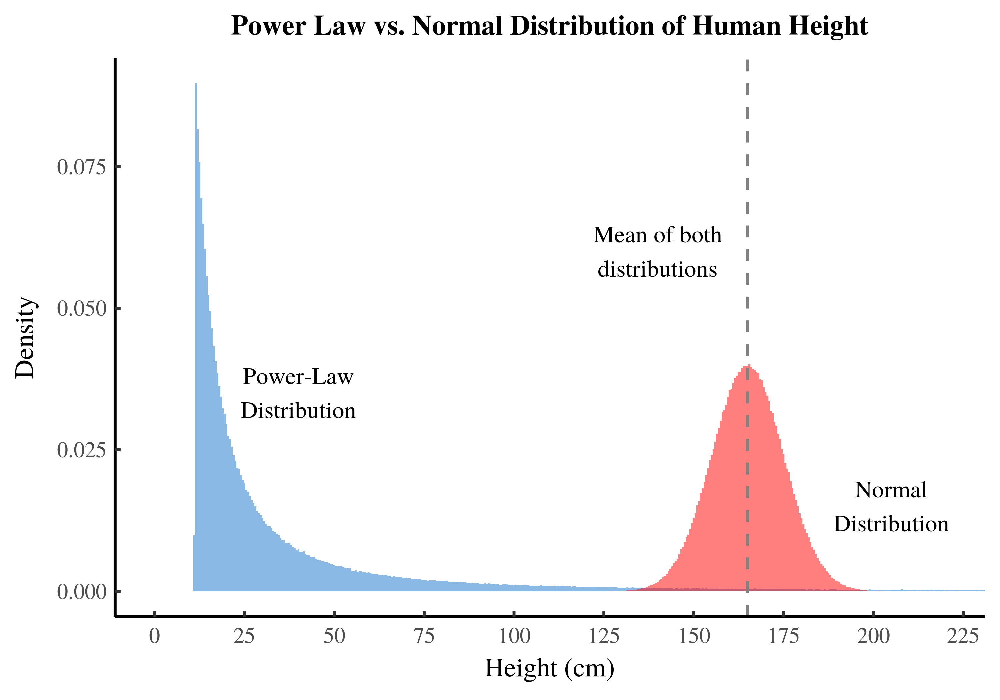

## 주제: Load Parameter은 무엇이며 어떻게 잡아야하는가?

1장에서 가장 모호하고 이해하기 어려운 주제라고 느꼈습니다.

## 책에서 정리된 내용을 먼저 봅시다.

트위터의 핵심 기능: `내가 팔로우한 사람들이 쓴 트윗을, 트윗 직후 5초안에 타임라인에서 봐야함.`

트위터의 당시 문제는 복합적입니다. 여러 단계로 설명해야합니다.

#### 1단계: 그냥 나이브하게 디비로 팔로우중인 사람의 트윗들을 JOIN SELECT한다면?

```SQL
SELECT tweets.*, users.* FROM tweets
  JOIN users ON tweets.sender_id = user_id
  JOIN follows ON follows.followee_id = user_id
  WHERE follows.follower_id = current_user
```

이 쿼리는 읽기 수가 매우 많은데

1. 캐싱이 어려움
2. 연산 자체가 매우 헤비함

이러한 문제 때문에 트위터에서 2단계로 변경했습니다.

#### 2단계: 수신자 마다 tweet 캐시를 미리 만들어두고, 캐시로 바로 푸시해주는 구조.

- write 시점에 훨씬 많은 연산을 미리 해둠.
- 평균 팔로워: 75명
- 초당 평균 4.6K 트윗, 피크 12k 이상.
- 평균 75 \* 4.6 = 캐시에 초당 345k 쓰기

초당 쓰기 수가 매우 많지만, 연산이 예측 가능해지고, 1단계에서의 로드 이슈가 사라졌습니다.

대신 여기에서 발생한 새로운 문제는 평균 팔로워가 75명인게 중요한게 아니라, 일부 소수의 팔로워가 많은 계정의 경우 팔로우 수가 몇백만이 될 수 있음이 문제입니다.

단 하나의 계정의 트윗으로 인해 피크가 몇십배 이상 올라갈 수 있는 치명적인 이슈가 존재했습니다.

그래서 트위터에서는 일부 팔로워가 많은 유저들에 대해서 조치를 취해야했습니다.

#### 3단계: 하이브리드 방식. 소수 유저만 select join, 나머지는 cache write.

- write이 미친듯이 많아지는 소수 유명 연예인 계정만 select join하도록 설정
- 나머지 팔로워 수가 적은 사람들은 캐시에 직접 write하는 구조
- 정확한 역치는 미공개지만 dyanmic/자주 업데이트 했을지도 모름
- 거의 10년 지난 아키텍처이기에 그 사이동안 트위터는 많이 바뀌었을 수 있음. 다만 그 시절 워킹했던 시스템 디자인임.

러닝:

- 2단계에서 load parameter를 평균 팔로워로 했더니 시스템이 망가져버림.
- 3단계로 넘어가면서 진짜 load parameter은 "팔로워 수와 이의 분포"임이 밝혀짐.
- load parameter란 쉽게 말하자면 우리가 k6 로드 테스트를 위해 조절을 하는 변수.

## Load Parameter의 정의

DDIA에서 말하는 load parameter 정의는 이겁니다:

- “시스템 부하를 가장 잘 설명하는 도메인 고유 변수”

트위터 예시의 경우:

- 평균 QPS, TPS는 아무 의미가 없음
- 팔로워 수는 power-law 분포
- 단 한 명의 셀럽이 시스템을 무너뜨릴 수 있음

로드 파라미터로 나머지가 어떻게 연쇄적으로 이슈가 되는지 설명할 수 있습니다:

```
Domain load parameter
→ Write amplification
→ Read amplification
→ Queue pressure
→ Cache skew
→ Shard hotness
```

## 다른 빅테크 Load Parameter 예시

#### 구글 검색

Load Parameter: 쿼리 결과 집합 크기

QPS는 비교적 안정적일 때

- "apple" → 수십억 문서
- "site:openai.com blog" → 수천 문서

이 파라미터가 바꾼 설계

- Early termination
- Top-K only
- Query planner
- Cost-based execution

“같은 QPS라도 매칭 문서 수가 1,000배 차이 난다”

power-law / log-normal 그래프 - x축: 쿼리당 매칭 문서 수 | y축: 해당 문서 수를 반환하는 쿼리 확률(빈도)

#### Netflix / Youtuber 스트리밍

Load Parameter: 동시 시청자 수 (per content)

- 사용자 수 ❌
- 업로드 수 ❌
- ‘한 영상에 몰리는 사람 수’가 전부

이 파라미터가 바꾼 설계

- CDN edge 중심
- Hot content replication
- Adaptive bitrate
- Origin offloading

“부하는 ‘사람 수’가 아니라 같은 영상을 동시에 보는 사람 수”

power-law 그래프 / log-normal - x축: 콘텐츠당 동시 시청자 수 | y축: 해당 시청자 수를 가진 콘텐츠 수

#### WhatsApp / Slack

Load Parameter: 메시지당 수신자 수 (Group Size)

- 1:1 메시지 → O(1)
- 10명 그룹 → O(10)
- 10만 명 채널 → fan-out 폭발

QPS는 같아도:

- 1 message × 1 recipient
- 1 message × 100,000 recipients

트위터 예시랑 매우 흡사함.

- Small group: write fan-out
- Large group / channel:
  - read fan-out
  - pull-based delivery
- Ack / retry 분리
- Delivery queue shard by group

“메시징 시스템의 부하는 메시지 수가 아니라 수신자 수다”

power-law 그래프 / log-normal - x축: 그룹/채널 크기 (수신자 수) | y축: 해당 크기의 그룹 수

#### Amazon DynamoDB / Aurora

Load Parameter: 파티션 키 접근 분포 (Key Hotness)

- 전체 QPS는 낮아도 하나의 hot key가 파티션 하나를 죽임
- order_id = 123 → 30% 트래픽 집중

이 파라미터가 바꾼 설계

- Hash partitioning
- Adaptive capacity
- Hot partition detection
- Write sharding (key salting)

“부하는 요청 수가 아니라 키 접근 분포의 왜도(skew) 다”

power-law 그래프 / log-normal - x축: 키 접근 빈도 순위 (1위 = 가장 많이 접근되는 키) | y축: 해당 키의 접근 횟수

## 죄다 예시들이 로그/지수 분포인데, 다 그런건가?



x축 - load paramter, y축 - 빈도 또는 확률 밀도

- 로드 파라미터 = 항상 로그/파워 분포는 아님.
- 하지만 “아키텍처를 망가뜨리는 애들”은 거의 그럼.

아닌 경우들 모음:

1. 의도적으로 제한된 분포

   - 시스템이 의도적으로 분포를 "관리" 하는 경우
   - 예: API Rate Limit - Requests per user ≤ 100 rps

   - load parameter: 요청 빈도
   - x축: 유저당 요청 빈도 (rps) | y축: 해당 빈도로 요청하는 유저 수
   - 분포: bounded (상한 제한으로 극단값 없음)
   - 결과:
     - 단순 horizontal scaling 가능
     - fan-out / hot-spot 거의 없음

2. 물리적/프로토콜 한계가 있는 경우

   - 극단값이 원천 차단됨
   - 예: 네트워크 MTU / 패킷 크기 - Packet size ≤ 1500 bytes

   - x축: 패킷 크기 (bytes) | y축: 해당 크기의 패킷 빈도
   - 분포: bounded
   - tail 없음
   - 아키텍처 영향 적음

3. Batch / Offline 시스템

   - power-law여도 문제가 안 됨
   - 예: ETL, MapReduce - Input size per job ≈ controlled

   - load parameter: job size
   - x축: job 크기 (input size) | y축: 해당 크기의 job 빈도
   - 분포: narrow / planned
   - 영향:
     - 스케줄링으로 흡수
     - tail latency 중요하지 않음

4. Stateless 계산 시스템

   - 예: 이미지 리사이징 API - Image size capped at 10MB

   - x축: 이미지 크기 | y축: 해당 크기의 요청 빈도
   - 분포: truncated
   - 작업 비용 예측 가능
   - 캐시/큐 간단

질문 하나로 어떤 경우를 예의 주시해야하는지 구분 가능함.

> “이 load parameter의 상한이 시스템 밖에서 강제되는가?”

| 경우                    | 분포       |
| ----------------------- | ---------- |
| 사용자 행동에 의해 결정 | power-law  |
| 시스템 정책으로 제한    | bounded    |
| 물리 법칙               | bounded    |
| 운영 계획               | controlled |

DDIA의 메시지는:

> “모든 분포가 power-law다” ❌

> “**무시하면 망하는 분포는 power-law다**” ✅

load parameter는 반드시 power-law 분포를 따르지 않으며, 사용자 행동에 의해 상한 없이 결정될 때에는 분포의 꼬리가 시스템 아키텍처에 큰 영향을 미치지만, 시스템 정책으로 상한을 정하면 단순하게 확장할 수 있다. 즉, 핵심은 power-law 그 자체가 아니라 통제되지 않은 사용자 행동이 시스템 설계에서 가장 큰 변수라는 점이다.

## 분포별 설계 전략 정리

| 분포 타입             | 설계 전략                  |
| --------------------- | -------------------------- |
| Power-law / long tail | hybrid, 분리, special-case |
| Log-normal            | P99 기준 capacity          |
| Uniform / bounded     | horizontal scale           |
| Batch-controlled      | scheduling                 |
| Truncated             | 단순 cache / queue         |

## 개인적인 러닝

#### 항상 지녀야할 메타적인 인지들

1. 어떤 변수가 가장 근원의 이슈인지 찾아야함
2. 보고 있는 변수가 멍청한 변수가 아닌지 고민해봐야함.
3. 지수/로그적인 성향을 띌 때 예측치 못한 이슈가 자주 나타남.
4. P95, p99 자체로도 지수/로그적인 성향이 강함.

#### 비효율 but 안정성 생각하면 생각보다는 비용 효율적

1. 트위터에서 write fan-out은 표면적인 비용은 훨씬 들어보이지만, 시스템 안정성을 그만큼의 돈을 내고 사온다고 생각함.
2. 효율이 떨어지고 비싸더라도 시스템 안정성이 그만큼의 값을 당장하는 방향성이라, 많은 기업에서 write fan-out과 유사한 방식으로 타임라인 피드를 만들었을 것이라고 생각함.
3. 이후 찹터에서 예시들을 더 많이 배우면 이해도가 높아질 것이라고 생각함. 지금은 겁먹지말고 계속 이해하려고 노력.
