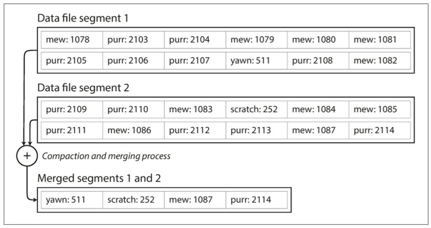
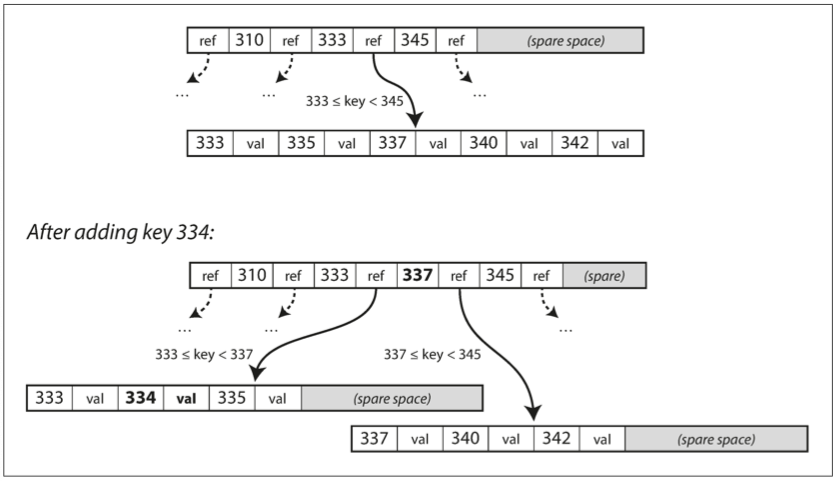
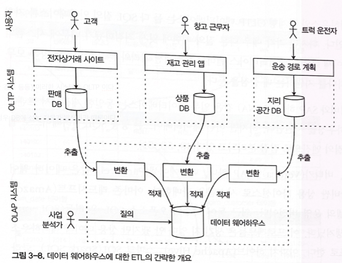
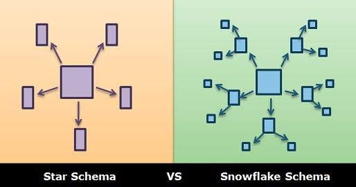
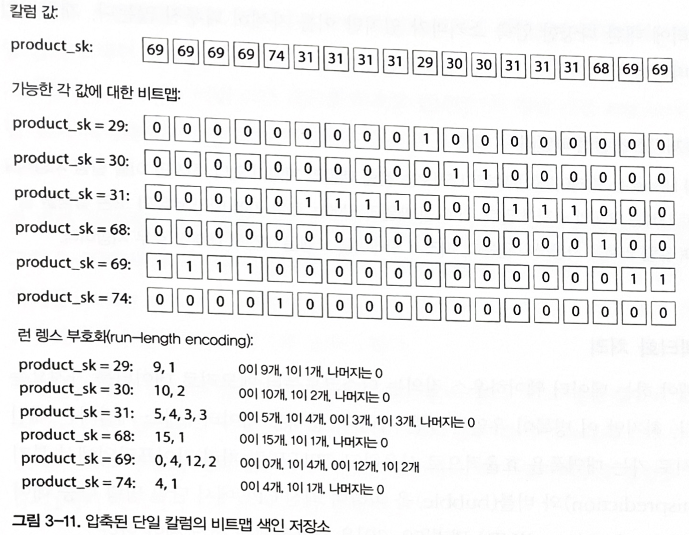
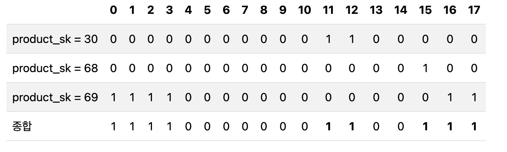
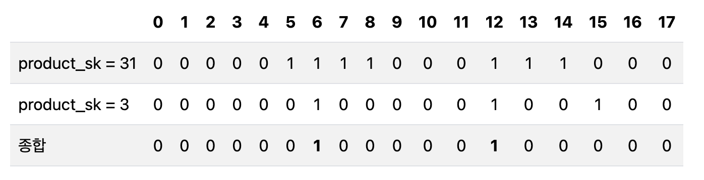
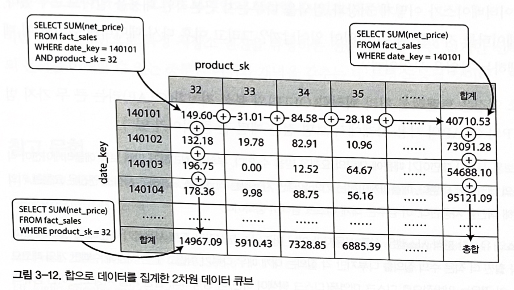

# Chapter 3. 저장소와 검색

## 개요

가장 기본적인 수준에서 데이터베이스 
- 어떤 데이터를 받으면 데이터를 저장하고 나중에 그 데이터를 요청하면 다시 데이터를 제공 (Read/Write)

개발자는 왜 내부 매커니즘을 알아야 하나
- 사용 가능한 여러 저장소 엔진 중에 애플리케이션에 적합한 엔진을 선택하는 작업이 필요하고 특정 작업 부하에서 좋은 성능을 내려면 대략적으로라도 알아야 한다

구분할 줄 알아야 하는 개념 
- OLTP 
- OLAP
- 컬럼지향 

저장소 엔진 개념 
- 로그 구조(Log-Structure)
- B트리 같은 페이지 지향 

---

## 1. 데이터베이스를 강력하게 만드는 데이터 구조

키-값 저장 형태로 간단히 구현
```bash
#!/bin/bash
 
db_set() {
    echo "$1, $2" >> database
}

db_get() {
    grep "^$1," database | sed -e "S/^$1,//" | tail -n 1
}
```
```bash
$ db_set 42 '{"name":"San Francisco","attractions":["Exploratorium"]}'

$ db_get 42
{"name":"San Francisco","attractions":["Exploratorium"]}

$ cat
123456,{"name":"London","attractions":["Big Ben","London Eye"]}
42,{"name":"San Francisco","attractions":["Golden Gate Bridge"]}
42,{"name":"San Francisco","attractions":["Exploratorium"]}

```
||저장(db_set) |	저장(db_get) |
|---|----|----|
|행위|	key와 value를 저장	|해당 key와 연관된 가장 최근 값을 찾아 반환|
|내부 동작 |	호출될 때마다 파일의 마지막에 추가(append) |	파일에 키의 마지막(최근) 항목을 검색 | 
|성능|	성능이 좋다.            |성능이 좋지 않다. |
||  간단한 작업인 경우에 좋다	| 레코드가 많을 수록 더 안 좋다 |

### 로그(log)란?
- 일반적으로 로그는 애플리케이션에서 무슨 일이 일어나는지 기술한 텍스트이다.
- 여기에서는 연속된 추가 전용(append-only) 레코드를 말한다.
- 많은 데이터베이스는 내부적으로 추가 전용(apend-only) 데이터 파일인 로그(log)를 사용한다.

### 검색 성능의 문제점
- 키가 있는지 찾기 위해 데이터베이스 파일을 처음부터 끝까지 스캔해야 한다.
- 알고리즘 용어로 검색 비용 O(n)이다.
- 레코드 수가 두배로 늘면, 검색도 두배로 오래 걸린다.

### 검색 성능의 개선 방법
- 데이터베이스에서 특정 키의 값을 효율적으로 찾기 위해 색인(index, 다른 데이터 구조)이 필요하다.
- 색인의 일반적인 개념을 어떤 부가적인 메타데이터를 유지하는 것이다.
- 메타데이터는 이정표 역할을 해서 원하는 데이터 위치에 찾은데 도움을 준다.
- 여러가지 다양한 방법으로 검색하고자 한다면, 데이터의 각 여러 가지 다양한 색인이 필요하다.

### 색인의 구조
- 색인은 기본 데이터(primary data)에서 파생된 추가적인 구조다.
- 색인은 질의 성능에 영향을 준다.
- 쓰기 과정에서 오버헤드가 발생한다.
- 데이터를 쓸 때마다 색인을 갱신해야 하기 때문이다.

### 색인의 선택
- 색인 선택에는 트레이드오프(trade-off)가 발생한다.
- 색인을 잘 선택했다면 읽기 질의 속도가 향상시킨다.
- 하지만, 모든 색인은 쓰기 속도를 떨어 뜨린다.
- 보통 자동으로 모든 것을 색인하지 않기에, 애플리케이션의 전형적인 질의 패턴에 대한 지식을 활용해 수동으로 색인을 선택해야 한다.
- 오버헤드를 발생시키지 않으면서, 애플리케이션에 가장 큰 이익을 안겨주는 색인을 선택해야 한다.

**일반적인 색인 선택 전략**

- Primary Key: 항상 색인 생성
- Foreign Key: 조인 성능을 위해 색인
- 자주 검색하는 컬럼: WHERE 절에 자주 등장하면 색인
- 범위 쿼리 컬럼: 날짜, 숫자 범위 검색 시 색인
- 정렬 기준 컬럼: ORDER BY에 사용되면 색인
- 개발자가 질의 패턴에 따라 **수동으로 적절한 색인 선택** 필요

---

## 2. 해시 색인(Hash Index)

> 키-값 데이터는 매우 일반적이고 더욱 복잡한 색인을 위한 구성 요소로 유용하다 \
대부분의 프로그래밍 언어에서 볼 수 있는 사전 타입(Dictionary type) 유사하고, Hash map(Hash table)으로 구현한다. \
키를 데이터 파일의 **바이트 오프셋(byte offset)**에 매핑해서 인메모리(in-memory) 해시 맵을 유지하는 전략으로 색인에 접근해 보자. \
바이트 오프셋은 그림 3-1과 같이 값을 바로 찾을 수 있는 위치이다.


- 추가 : 파일에 새로운 key-value 쌍을 추가할 때마다 방금 기록한 데이터의 offset 을 반영하기 위해 hash map 도 갱신해야 한다.
- 조회 : 조회할 때는 hash map 을 사용해 데이터 파일에서 offset 을 찾아 해당 위치를 구해서 값을 읽는다.

### Riak의 비트케스크
- 위에 방식은 Riak의 비트케스크(Bitcask, 기본 저장 엔진)가 사용하는 방식이다.

해시맵을 전부 메모리에 유지하기 때문에 RAM에 모든 키가 저장된다는 조건을 전제로 고성능 읽기, 쓰기를 보장한다. \
값은 한번의 디스크 탐색으로 디스크에 적재할 수 있기 때문에 사용 가능한 메모리보다 더 많은 공간을 사용할 수 있다. 
  - 데이터 파일의 일부가 파일 시스템 캐시에 있다면 읽기에 디스크 입출력도 필요하지 않다. 

이런 형태의 저장소는 각 key의 value가 자주 갱신되는 상황에 매우 적합하다.

### 디스크 공간 부족의 해결책
그런데 지금과 같은 상황으로 파일에 계속해서 추가만 된다면 결국 디스크 공간이 부족해 진다. 
이럴때 특정 크기의 세그먼트로 로그를 나누는 방식이 좋은 해결책이다.
- 특정 크기에 도달하면 세그먼트 파일을 닫고 새로운 세그먼트 파일에 이후 쓰기를 수행한다.
- 세그먼트 파일에 대해 **컴팩션(compaction)**을 수행한다.
  - 컴팩션(compaction)란? 로그에서 중복된 키를 버리고 각 키의 최신 갱신 값만 유지하는 것을 의미한다.


### 컴팩션과 세그먼트 병합

컴팩션은 세그먼트를 더 작게 만들 수 때문에, 컴팩션을 수행할 때는 동시에 여러 세그먼트들을 병합할 수 있다.

- 세그먼트가 쓰여진 후에는 변경할 수 없기 때문에, 병합할 세그먼트는 새로운 파일로 만든다.
- 고정된 세그먼트의 병합과 컴팩션을 백그라운드로 스레드로 수행할 수 있어, 컴팩션을 수행하는 동안 이전 세그먼트 파일을 사용해 읽기와 쓰기 요청의 처리를 정상적으로 계속 수행할 수 있게 된다.
- 병합 과정이 끝난 이후에는 읽기 요청은 이전 세그먼트 대신 새로 병합한 세그먼트를 사용하게끔 전환한다.
- 전환 후에는 이전 세그컨트 파일을 삭제된다.


병합된 세그먼트는 키를 오프셋에 매핑한 자체 인메모리 해시 테이블에 반영한다.\
키의 값을 찾으려면 세그먼트 해시 맵을 먼저 확인한다. 만약 없다면 두 번째 최신 세그먼트 등을 확인 한다.\
병합 과정을 통해 세그먼트 수를 적게 유지하면 조회할 때 많은 해시 맵을 확인할 필요가 없다.

### 실제 구현할 때 주의해야 할 점

- 파일 형식
  - key-value 를 구분하는 것이 콤마(,) 이다. 그렇다고 해서 CSV 가 적합한 형식은 아니다.
  - 문자열을 부호화하는 바이너리 형식을 사용하는 것이 더 빠르고 간단하다.
- 레코드 삭제
  - 키에 해당하는 값을 삭제하려면, 데이터 파일에 특수한 삭제 레코드(Tombstone, 묘비)를 추가해야 한다.
  - 로그 세그먼트 이 톰스톰을 병합 과정에서 삭제된 키의 이전 값을 무시하게 한다.
- 고장(Crash) 복구
  - 데이터베이스가 재시작되면 in-memory hash map은 손실된다.
  - 데이터가 커지면 hash map을 복원하는데 오래 걸리기 때문에 스냅샷(Snapshot)을 만들어 디스크에 저장하여 복구 속도를 높일 수 있다.
- 부분적으로 레코드 쓰기
  - 데이터베이스에서 로그에 record를 추가하는 도중에 죽을 수 있다.
  - bitcask 파일은 checksum을 포함하고 있어서 로그의 손상된 부분을 탐지해 무시할 수 있다.
- 동시성 제어
  - 순차적으로 로그에 추가할 때 일반적인 구현하는 방법은 Single thread만 사용한다.
  - 읽기는 불변(immutable)이므로,Multi thread 로 동시에 읽기를 할 수 있다.

### 추가 전용(append-only) 로그의 이점
추가 전용(append-only) 로그는 언뜻 보면 낭비처럼 보인다. 왜 파일의 그 자리에서 오래된 값을 갱신하지 않는 것일까? 하지만 append-only 설계는 여러 측면에서 좋은 설계이다.

- append-only 와 segment 병합은 순차적인 쓰기 작업이기 때문에 보통 무작위 쓰기보다 빠르다.
  - 특히 자기 회전 디스크 하드 드라이브에서 더 빠르다.
- segment 파일이 추가 전용이나 불변이면 동시성과 고장 복구가 간단하다.
  - 값을 덮어 쓰는 동안 DB 가 죽는 경우에 대해서 걱정할 필요가 없다. 이전 값 부분과 새로운 값 부분을 포함한 파일을 나누어 함께 남겨두기 때문이다.
  - 오래된 segment 병합은 시간이 지남에 따라 조각화되는 데이터 파일 문제를 피할 수 있다.

### 해시 테이블 색인 제한 사항
그러나 hash table index 역시 한계가 있다.

- 메모리 저장해야 하므로 키가 너무 많으면 문제가 된다.
  - 디스크에 hash map 을 유지할 수 있지만 디스크 상에서 좋은 성능을 기대하기 어렵다.
  - 이는 무작위 접근 I/O 가 많이 발생하고 디스크가 가득 찼을 때 확장하는 비용이 비싸며 해시 충돌 해소를 위해 성가신 로직이 필요하다.
- range query 에 효율적이지 않다.
  - 해시 맵에서 모든 개별 키를 조회해야 한다.

다음에는 이런 제한이 없는 색인 구조를 살펴보자.

## 3. SS 테이블과 LSM 트리
일련의 키-값 쌍으로 키로 정렬하는 것이다. 이런 변경은 순차 쓰기(append-only)를 할 수 없게 하는거 같지만, 뒤에서 알아보겠다.

키로 정렬된 형식을 정렬된 **문자열 테이블(Sorted String Table, SS테이블)**이라고 한다. 각 키가 병합된 세그먼트 파일 내에는 한번만 나타나야 한다(이미 컴팩트 과정이 이를 이미 보장한다).

### 해시 색인을 가진 로그 세그먼트 비교한 SS 테이블의 장점
- 세그먼트 병합은 파일이 사용가능한 메모리보다 크더라도 간단하고 효율적이다. 병합 정렬(mergesort) 알고리즘의 방식과 유사하다.
- 각 세그먼트를 읽고 첫 번째 키를 본다(이미 정렬되어있고, 그 순서대로) 그리고 가장 낮은 키를 출력 파일로 복사한뒤 이 과정을 반복한다.


- 여러 SS테이블 세그먼트를 병합하고 각 키의 최신 값만 유지한다.
- 여러 세그먼트에 동일한 키가 있다면 어떻게 해야 할까? 
    - 다중 세그먼트가 동일한 키를 포함하는 경우 가장 최근 세그먼트의 값은 유지하고 오래된 세그먼트의 값은 버린다.

---
- 파일에서 특정 키를 찾기 위해 모든 키를 메모리에 색인으로 유지할 필요는 없다.
- 아래 그림에서 handiwork 를 보면 handbag 과 handsome 사이에 있음을 알 수 있다.


--- 
- 읽기 요청은 요청 범위 내에서 key-value 를 스캔해야 한다. 
- 따라서 record를 블록으로 그룹화 하고 디스크에 쓰기 전에 압축한다. 그러면 key는 압축된 블록의 시작을 가리키게 된다.
- disk 공간을 절약하는 것 외에도 I/O를 줄일 수 있다.

## SS테이블 생성과 유지 (Constructing and maintaining SSTables)
그런데 이러한 기능을 구현할 수 있는것은 key 가 정렬되어 있기 때문이다. 쓰기 요청은 유입되는 순서대로 쓰기가 발생한다.

디스크에 정렬된 구조를 유지하는 것은 가능하지만(B트리 참조), 메모리에 유지하는 편이 더 쉽다. \
레드 블랙 트리(red-black tree)나 AVL 트리와 같이 잘 알려진 데이터 구조 등은 많이 있다. \
이러한 데티터 구조를 이용하면 임의 순서로 키를 삽입하고 정렬된 순서로 해당 키를 다시 읽을 수 있다. \

### 저장소 엔진 구현
저장소 엔진은 다음과 같이 만들 수 있다.

- 쓰기가 들어오면 균형 트리(balanced tree)에 추가한다.
  - 이 인메모리는 맴테이블(memtable)이라고도 한다.
- 이 맴테이블이 임계값 보다 커지면 SS테이블 파일로 디스크에 기록한다.
  - 이미 정렬되어 있기 때문에 효율적으로 저장할 수 있다.
  - 이 새로운 SS테이블은 DB의 가장 최신 세그먼트가 된다.
- 읽기 요청이 있으면 맴테이블에서 키를 찾는다.
  - 없으면 그 다음 가장 최신의 세그먼트, 또 없으면 그 다음으로 오래된 세그먼트를 찾는다.
- 가끔 세그먼트 파일을 합치고 덮어 쓰여지거나 삭제된 값을 버리는 병합과 컴팩션 작업을 한다.
  - 이는 background 에서 수행한다.

### 저장소 엔진 장애 발생시 대응법
- DB가 고장나서 디스크로 기록되지 않은 memtable 이 있다면, 이 데이터는 손실 될 수 있으므로 append-only 로그를 디스크 상에 유지해야 한다.
- 이 로그는 데이터를 복구하는데만 사용하며 정렬되지 않아도 문제가 없다. 맴테이블은 SS테이블로 기록하고 나면 해당 로그는 버린다.

## SS테이블에서 LSM 트리 만들기 (Making an LSM-tree out of SSTables)
이런 색인 구조를 로그 구조화 병합 트리(Log-Structred Merge-Tree, LSM)란 이름으로 패트릭 오닐(Patrick O`Neil) 등이 발표했다. \
정렬된 파일 병합과 컴팩트 원리를 기반으로 하는 저장소 엔진을 LSM 저장소 엔진이라 부른다.

루씬(Lucene) 루씬(Lucene)은 엘라스틱서치나 솔라에서 사용하는 전문 검색 색인 엔진이다. \
루씬은 용어 사전(term dictionary)을 저장하기 위해 유사한 방법으로 전문 검색을 구현했다. \
질의 단어가 들어오면 단어가 언급된 모든 문서를 찾는다. \
이 접근법이 키를 단어(용어)로, 같은 값을 포함한 모든 문서의 ID 목록으로 하는 key-value 로 구현한다. \
용어와 용어에 해당하는 문서를 SS테이블 같은 정렬 파일에 유지하고 필요에 따라 background 에서 병합한다. 

## 성능 최적화 (Performance optimizations)
LSM 트리 알고리즘은 데이터베이스에 존재하지 않는 키를 찾는 경우 느릴 수 있다. 앞에서 설명 했듯이 맴테이블을 검색하고, 가장 오래된 세그먼트까지 검색해야 하기 때문이다.

이런 종류의 접근을 최적화하기 위해 **블룸 필터(bloom filter)**라는 것을 사용한다. \
(블룸 필터는 집한 내용을 근사한(approximating) 메모리 효율적 구조이다. 키가 데이터베이스에 존재하지 않음을 알려주므로 불필요한 디스크 읽기를 줄일 수 있다.)

또한, SS테이블을 압축하고 압축(compaction)하고 병합(merge)하는 순서와 시기를 다양한 전략이 있다. \
대표적으로 **크기 계층(사이즈 계충, size-tiered)**과 **레벨 컴팩션(level compaction)**이 있다. LevelDB, LocksDB가 이 이름을 따왔다고 한다.

- 크기 계층 컴팩션
  - 상대적으로 좀 더 새롭고 작은 SS테이블을 오래되고 큰 SS테이블에 연이어 병합한다.
  - HBase, 카산드라
- 레벨 컴팩션
  - 키 범위를 더 작은 SS테이블로 나누고 오래된 데이터는 개별 “level” 로 이동하기 때문에 컴팩션을 점진적으로 진행해 디스크 공간을 덜 사용했다.
  - 레벨DB(LevelDB, 레벨DB이라는 이름이 레벨 컴팩션에서 유래), 룩스DB(LocksDB), 카산드라

LSM 트리의 기본 개념은 백그라운드에서 연쇄적으로 SS테이블을 나누고 순차적으로 병합하는 것이다. \
이 개념은 데이터셋이 가능한 메모리보다 훨신 더 크더라도 여전히 효과적이다. \
이 접근법은 디스크 쓰기가 순차적이기 때문에 LSM 트리가 매우 높은 쓰기 처리량을 보장할 수 있다.

## B 트리
로그 구조화 색인은 보편화 되고 있지만 일반적은 색인 유형이 아니다. 가장 널리 사용되는 색인 구조가 **B 트리(B-Tree)**로 구조가 로그 구조화 색인과는 상당히 다르다.

B 트리는 1970년에 등장하여 오래동안 테스트되어 왔다. B-tree 인덱스는 RDB, NoSQL 모두 사용된다. \
SS 테이블과 같이 키로 정렬된 키-값을 유지하기 때문에 키-값 검색과 범위 질의에 효과적이다. 로그 구조화 색인 비슷한 점이 이거 뿐이다.

로그 구조화 색인은 세그먼트로 나누고 항상 순차적으로 세그먼트에 기록하는 방식이지만, \
B-Tree 는 4KB 크기(때로는 더 큰)의 고정 블록이나 페이지로 나누고 한번에 하나의 페이지에 읽기 또는 쓰기를 한다. \
디스크가 고정 크기 블록으로 배열되기 때문에 하드웨어와 더 밀접한 관련이 있다.

각 페이지는 주소나 위치를 통해 식별할 수 있고, 이 방식 때문에 다른 페이지를 참조할 수도 있다(포인트와 비슷하지만 메모리 대신에 디스크에 있다).


한 페이지가 B 트리의 루트(root) 로 지정된다.  \
위 예제에서 보면 키 251을 찾기 위해 루트의 200~300 경계 사이의 페이지 참조를 따라가고, 다시 더 작은 범위로 나눈 페이지로 이동한다. \
최종적으로 개별 키(leaf page)를 포함한 페이지에 도달한다.

B 트리의 한 페이지에서 하위 페이지를 참조(ref)하는 수를 분기 계수(branching factor)라고 부른다. \
위 예제에서의 분기 계수는 6이다. 실제로 분기 계수는 페이지 참조와 범위 경계를 저장하는데 보통 수백 개에 달한다.

B 트리에 존재하는 키의 값의 값을 갱신하려면, 키를 포함하고 있는 리프(leaf) 페이지를 검색하고 페이지의 값을 바꾼 다음 페이지를 디스크에 다시 기록한다. \
새로운 키를 추가하려면, 새로운 키의 범위를 포함하는 페이지를 찾아 해당 페이지에 키와 값을 추가한다. \
새로운 키를 수용한 페이지에 충분한 공간이 없다면, 페이지를 반쯤 채워 페이지 둘로 나누고 상위 페이지가 새로운 키 범위의 하위 부분을 알 수 있게 갱신하는 작업을 한다.


이 알고리즘은 트리가 계속 균형을 유지하는 것을 보장한다. n개의 키를 가진 B 트리는 깊이가 항상 O(logn) 이다. \
대부분 DB에서 깊이는 3~4 단계면 충분하다. \
분기 계수 500의 4KB페이지의 4단계 트리는 256TB 까지 저장할 수 있다.

## 신뢰할 수 있는 B트리 만들기 (Making B-trees reliable)
B 트리의 기본적인 쓰기 동작은 새로운 데이터를 디스크 상 페이지에 덮어쓴다. \
이 동작은 덮어 쓰기가 페이지 위치를 변경하지 않는다고 가정한다. 페이지를 덮어 쓴다고 해도 페이지를 가리키는 참조는 온전하게 남는다.

LSM 트리와 같은 로그 구조화 색인과는 대조적이다. 로그 구조화는 색인 파일을 추가할 뿐 같은 같은 위치의 파일은 변경하지 않는다. \
디스크 페이지를 덮어쓰는 일은 실제 H/W 동작이라 생각할 수 있다. SSD의 경우는 칩의 상당한 블록을 한번에 지우고 다시 쓰기를 해야하기 때문에 조금 더 복잡하다.

### 데이터 고장시 복구
일부 페이지만 기록하고 데이터베이스가 고장이 난다면 결국 색인이 훼손되기 때문에 매우 위험하다.
데이터베이스가 고장이 난 상황에 스스로 복구하게 하려면, 쓰기전 로그(Write-ahead log, WAL, (재실행 로그, redo log)라고도 함)라는 데이터 구조를 추가 B-Tree를 구현한다.

쓰기 전 로그는 B-Tree의 변경 사항을 기록하는 추가 전용(append-only) 파일이다. 이 로그는 고장 이후 복구될 때 일관성 있게 B-Tree를 복원하는 데 사용한다.

### 동시성 제어
다중 스레드가 동시에 B-Tree에 접근한다면 주의 깊게 동시성 제어를 해야하는데, 이때 랜치(latch, 가벼운 잠금(lock))로 트리를 보호한다.

로그 구조화 접근 방식은 이 상황에서 더 간단하다. 유입 질의에 간섭 없이 백그라운드에서 모든 병합를 수행하고 이따금 원자적으로 새로운 새그먼트 이전 세그먼트로 바꾸기 때문이다.

## B 트리 최적화 (B-tree optimizations)
B 트리는 오랜 동안 사용되면서 개발된 많은 최적화 기법이 있다. 몇가지를 언급하자면 다음과 같다.

- 페이지 덮어쓰기와 WAL을 유지하는 대신, 쓰기 시 복사 방식(copy-on-write scheme)을 사용한다. 변경된 페이지는 다른 위치에 기록하고 트리 상위 페이지의 새로운 버젼을 만들어 새로운 위치를 가리킨다.
  - 동시성 제어에 유용하다.
- 페이지에 전체 키를 저장하는 것이 아니라 키를 축약해 쓰면 공간을 절약할 수 있다. 페이지 하나에 키를 더 많이 채워 더 높은 분기 계수를 얻는다.
  - leaf 를 찾는 깊이 수준을 낮출 수 있다.
- 페이지는 디스크 상 어디든지 존재할 수 있다. 하지만 leaf 페이지 만큼은 디스크 상 연속된 순서로 나타나게끔 트리를 배치하려 시도한다.(하지만 트리가 커진다면 어렵다)
  - 로그 구조화 기반과 비교하면, 병합과 압축 과정에서 세그먼트를 다시 쓰기 때문에 연속된 키를 더 가깝게 유지하기 쉽다.
- 트리에 포인터를 추가하여, 상위 페이지로 이동하지 않고 형제 페이지로 바로 이동하게 만들 수 있다.
- 프랙탈 트리(fratal tree)와 같은 B 트리 변형은 디스크 찾기를 줄이기 위해 로그 구조화 개념을 일부 빌렸다.

## 3. B 트리와 LSM 트리 비교

B 트리가 LSM 트리보다 일반적으로 구현 성숙도가 더 높지만 LSM 트리도 그 성능 특성 때문에 여전히 관심을 받는다. \
LSM은 쓰기에 빠르고 B-tree 는 읽기에 더 빠르다. 읽기가 보통 LSM 트리에서 더 느린 이유는 컴팩트 단계에 있는 여러 데이터 구조와 SS 테이블을 확인해야 하기 때문이다.

### LSM 트리의 장점 (Advantages of LSM-trees)
- B-Tree
  - 색인은 모든 데이터 조각을 최소한 두번 기록한다.
    - 쓰기 전 로그(WAL)에 한번, 트리 페이지에 한번(페이지가 분리될 때 다시 기록) 이다.
  - 해당 페이지 내 몇 byte 만 바뀌어도 전체 페이지를 기록해야 하는 오버헤드가 존재하기도 한다.
  - 일부 엔진은 전원 장애가 발생했을 때 일부만 갱신된 페이지로 끝나지 않게 두번 덮어 쓴다.(innoDB)
- LSM (로그 구조화 색인)
  - SS테이블의 반복된 compaction, merge 로 여러번 다시쓴다.

> 이렇게 한번 쓸때 여러번 쓰는 작업을 쓰기 증폭(write amplification)이라 하는데, SSD의 경우 블록에 덮어 쓰기 횟수가 정해져 있기 때문에 쓰기 증폭은 특별한 관심사 이다. \
쓰기가 많은 애플리케이션에서 디스크의 쓰기 증폭이 성능에 중요한 영향을 미친다.(저장소 엔진이 기록할수록 디스크 대역폭 내 초당 쓰기는 점점 줄어든다)

- LSM 트리는 B 트리보다 쓰기 처리량을 높게 유지할 수 있다.
  - 컴팩트과 병합 작업 때문에 B 트리에 비해 쓰기 증폭이 낮다. 특히 HDD 라면 순차 쓰기가 임의 쓰기 보다 훨씬 더 빠르기 때문에 적합하다.
- LSM 트리는 압축률이 좋다.
  - B 트리보다 더 적은 파일을 생성한다.
  - B tree 는 파편화로 인해 디스크 공간 일부가 남는다. (일부 공간을 사용하지 않음)
  - SS테이블을 다시 기록하면서 저장소 오버헤드가 낮다.
  - 이 장점은 SSD 에서도 유리하다(SSD는 임의 쓰기를 순차 쓰기로 전환할때 LSM 알고리즘을 사용한다)

### LSM 트리의 단점 (Downsides of LSM-trees)
LSM 트리의 단점은 캠팩트 과정으로 인해 읽기와 쓰기의 성능에 영향을 준다. \ 
디스크가 가진 자원은 한계가 있다. 그래서 디스크에서 값 비싼 컴팩트 연산이 끝날 때까지 요청이 대기해야 하는 상황이 발생하기 쉽다. \
물론 처리량과 평균 응답 시간이 성능에 주는 영향은 작지만, 백분위로 비교하면 종종 매우 길어지는 시간이 존재한다.

반면, B 트리의 성능은 상대적으로 예측하기 쉽다. 

쓰기 처리량이 높다 하더라도 설정을 주의 깊게 하지 않으면 컴팩션이 유입 속도를 따라가지 못하는 경우가 발생한다. \
유입 속도에 맞춰 컴팩션이 줄어드는것이 아니기 때문에 이런 상황을 감지하기 위한 명시적인 모니터링이 필요하다.

또한, 키의 다중 복사본이 여러 세그먼트에 존재할 수 있다. \
B 트리는 이것이 한 곳에 모여 있기 때문에 강력한 트랜잭션 시멘틱(semantic)을 제공하는 데이터베이스는 B 트리가 더 매력적일 수 밖에 없다(제세한 내용은 7장).

요즘 나오는 저장소는 LSM 방식을 많이 채택하는데 그럼에도 불구하고 많은 작업 부하에 B 트리는 지속적으로 좋은 성능을 나타내기 때문에 사라질 가능성은 거의 없다.

--- 
skip 

기타 색인 구조 (Other Indexing Structures)

색인 안에 값 저장하기 (Storing values within the index)

다중 칼럼 색인 (Multi-column indexes)

전문 검색 색인과 퍼지 색인 (Full-text search and fuzzy indexes)

모든 것을 메모리에 보관 (Keeping everything in memory)

---


## 4. 트랜잭션 처리와 분석 
초창기 비즈니스 모델은 논리 단위의 형태로 읽기와 쓰기 그룹을 나타내는 커머셜 트랜잭션(commercial transaction, 상거래)에 해당한다.

금전 거래가 아닌 영역으로 데이터베이스가 확장됐어도 트랜잭션이란 용어는 변하지 않고 논리 단위 형태로서 읽기와 쓰기 그룹을 나타내고 있다.
### 온라인 트랜잭션 처리(OnLine Transaction Processing, OLTP)
- 레코드가 사용자 입력을 기반으로 삽입되거나 갱신됨

### 온라인 분석 처리(OnLine Analytic Processing, OLAP)
- 데이터 분석 용도
- 많은 수의 레코드를 스캔해 레코드당 일부 칼럼만 읽어 집계 통계를 계산
  - ex) 1월의 각 매장의 총 수익, 평소보다 많은 프로모션 기간의 바나나 판매량
- 비즈니스 분석가가 작성하고 회사 경영진에게 제공해 의사결정을 돕는다.
  - 비즈니스 인텔리전스(business intelligence)

### 트랜잭션 처리와 분석 시스템의 특징 비교
|특성|	트랜잭션 처리 시스템(OLTP)|	분석 시스템(OLAP)|
|---|---|---|
|주요 읽기 패턴|	질의당 적은 record, 키 기준 fetch|	많은 record 에 대한 집계|
|주요 쓰기 패턴|	임의 접근, 사용자 입력을 낮은 지연 시간|	대규모 불려오기(bulk import, ETL), 이벤트 스트림(event stream)|
|주요 사용처|	웹 앱, 사용자, 소비자 의사 결정을 위한 내부 분석가	
|데이터 표현 데이터의 최신 상태(현재 시점, 실시간) 시간이 지나며 발생된 이력(과거)||		
|데이터셋 크기|	기가바이트에서 테라바이트|	테라바이트에서 페타바이트|
|최적화 방법|	트랜잭션 효율화, 무결성의 극대화 조회 속도, 정보의 가치, 편의성||	
|데이터의 특성|	트랜잭션 중심|	정보 중심|
- 처음에는 트랜잭션 처리와 분석 질의를 위해 동일한 데이터베이스를 사용했다.
- 개별 데이터베이스를 데이터 웨어하우징(Data warehouse)라고 불렸다.

### 데이터 웨어하우징 
- OLTP 작업에 영향을 주지 않고 마음껏 질의할 수 있는 개별 데이터베이스
- 회사 내의 모든 다양한 OLTP 시스템에 있는 데이터의 읽기 전용 복사본
- 개별 데이터 웨어하우스를 사용하면 분석 접근 패턴에 맞게 최적화 가능

#### ETL(Extract-Transform-Load)
- OLTP 데이터베이스에서 데이터를 추출(extract)하고
- 분석 친화적인 스키마로 변환(transform)하고
- 데이터 웨어하우스에 적재(load)한다



### OLTP 데이터베이스와 데이터 웨어하우스의 차이점 (The divergence between OLTP databases and data warehouses)
표면적으로 데이터 웨어하우스와 관계형 OLTP 데이터베이스는 둘 다 SQL 질의 인터페이스를 지원하기 떄문에 비슷해보인다.
- 하지만 각각 매우 다른 질의 패턴에 맞게 최적화됐기 때문에 시스템의 내부는 완전히 다르다.
- 공통 SQL 인터페이스로 접근할 수 있는 저장소와 질의 엔진으로 점점 분리되고 있다.

#### 상용 라이선스 데이터 웨어하우스 벤더
- 테라데이터(Teradata)
- 버티카(Vertica)
- SAP 하나
- 파르에이셀(ParAccel)
#### 오픈소스 SQL 온 하둡(SQL-on-Hadoop)
- 아파치 하이브(Apache Hive)
- 스파크 SQL(Spark SQL)
- 클라우데라 임팔라(Cloudera Impala)
- 페이스북 프레스토(Facebook Presto)
- 아파치 타조(Apache Tajo)
- 아파치 드릴(Apache Drill)

## 분석용 스키마: 별 모양 스키마와 눈꽃송이 모양 스키마 (Stars and Snowflakes: Schemas for Analytics)
별 모양 스키마(star schema - 차원 모델링 dimensional modeling)로 알려진 정형화된 방식을 사용한다.

사실 테이블(fact table)이 가운데에 있고 차원 테이블로 둘러싸고 있는 모양


사실 테이블(fact table): fact_sales
- 특정 시각에 발생한 이벤트(제품 구매) 사실 테이블의 다른 컬럼은 차원 테이블(dimension table)이라 부르는 다른 테이블을 가리키는 외래 키 참조다

- 차원은 이벤트의 속성
  - 누가(dim_customer)
  - 언제(dim_date)
  - 어디서(dim_store)
  - 무엇을(dim_product)
  - 어떻게(dim_promotion) 

### 눈꽃송이 모양 스키마(snowflake schema)
- 별 모양 스키마의 변형이다.
- 차원이 하위차원으로 더 세분화된다.
  - 질의를 수행하기 위해서 더 많은 조인을 필요 → 검색의 효과를 감소 → 시스템의 성능에 악영향을 끼칠 수 있다.
- 데이터웨어하우스는 설계에 있어서 스타스키마 만큼 널리 쓰이지 않는다.



## 5. 컬럼지향 저장소
데이터 웨어하우스의 사실 테이블에는 엄청난 개수의 로우의 페타바이트 데이터가 있다면 효율적으로 저장하고 질의하기에는 어려운 문제가 있다.

일반적으로 데이터 웨어하우스에서 한번에 4, 5개의 컬럼만 접근한다 (SELECT * 를 사용하는 일은 거의 없다)

대부분의 OLTP 데이터베이스에서 저장소
- 로우 지향 방식으로 데이터를 배치한다.
- 데이틀에 한 로우의 모든 값은 서로 인접하게 저장된다.
  - 문서 데이터베이스와 유사하다. 문서 데이터베이스는 전체 문서를 보통 하나의 연속된 바이트 열로 저장한다.

fact_sales 에서 3개의 컬럼에만 접근한고 했을 때, date_key, product_sk 둘 중하나에만 색인이 있다고 가정하자. \
이 색인은 저장소 엔진에 특정 날짜나 특정 제품의 모든 판매 내용을 찾을 수 있는 위치를 알려준다. \
하지만 위와 같은 질의를 처리하기 위해서는 디스크에서 100개 이상의 속성을 포함하는 로우(row)를 모두 메모리에 적재하고, \
구문을 분석하여 필요한 조건을 충족하는 로우를 필터링 하는 방식으로 대응하는데 이것은 시간이 너무 오래걸린다.

컬럼 지향 저장소의 개념은 모든 값을 하나의 로우에 저장하지 않고 모든 값(column)을 함께 저장한다.
- 각 칼럼은 개별 파일에 저장하면 질의에 필요한 칼럼만 읽고 구문 분석할 수 있다.
- 각 칼럼 파일에 포함된 로우가 모두 순서가 같아야 한다.


- 컬럼 지향 저장소 배치는 각 컬럼 파일에 포함된 로우가 모두 같은 순서인 점에 의존한다.
- 예를 들면, 23번째 데이터를 모두 모으려면 컬럼별로 23번째에 해당하는 모든 데이터를 가져오면 된다.

## 컬럼 압축
데이터를 압축하면 디스크 처리량을 줄일 수 있다.
- 컬럼 저장소는 대개 압축에 적합하다.

컬럼의 데이터에 따라 다양한 압축 기법을 사용할 수 있다.
- 데이터 웨어하우스에 효과적인 압축 중 비트맵 부호화(bitmap encoding)이다.


보통 컬럼에서 고유 값의 수는 로우에 비해 적다.(판매되는 제품의 고유한 수가 10만개, 판매 거래는 수십억)

그러면 n개의 고유 값을 가진 column(69,69,69,69,74,31,31…) 을 가져와 n개의 개별 비트맵으로 변환하는데(product_sk 별 비트맵을 따로 가짐) 만약 row가 해당 값을 가지면 비트는 1이고 그렇지 않으면 0 이다.

위와 같은 상황으로 보면 비트맵엔 0이 더 많은데 이것을 런 렝스(run-length) 부호화를 하여 한번 더 압축이 가능하다.

- 런 렝스 부호화
  - ex) AABBBBCC(8byte) → A2B4C2(6byte)
- where product_sk in (30, 68, 69)
  - product_sk = 30, product_sk = 68, product_sk = 69 에 비트맵 3개를 적재하고 3개 비트맵의 비트를 or 로 계산한다.


- where product_sk = 31 and store_sk = 3 \
product_sk = 31, store_sk = 3 으로 비트맵을 적재하고 and 계산한다.


이런 계산은 각 컬럼에 동일한 순서로 row 가 포함되기 때문에 가능하다.

|B-Tree	| Bitmap index |
|--|--|
|큰 분포도를 갖는 테이블에 적합	|적은 분포도를 갖는 테이블에 적합|
|비교적 키의 갱신 비용이 적음|	갱신 비용이 매우 큼|
|OR 사용 Query 비효율적	|OR 사용 Query 효율적|
|OLTP에 유용함|	Cardinality가 낮고 대량의 데이터에 대한 조회 작업이 많은 시스템에 유용함|

#### 비트맵 인덱스의 탄생 배경
B-tree 가 가진 문제점을 해결하기 위해..
- B-tree 인덱스에서는 실제 칼럼 값을 보관: 대용량 데이터를 관리에는 부담
- 결합 인덱스에서 조건을 사용하지 않는 칼럼이나 =(equals) 조건이 아닌 칼럼이 결합 인덱스 중간에 있으면 액세스 효율이 떨어짐
- 다양한 액세스 패턴을 수용하기 위해 많은 인덱스가 필요할 수 있음
- NOT 이나 NULL을 사용하거나 복잡한 OR 조건에서는 인덱스의 성능을 보장받지 못함

> 칼럼 지향 저장소와 칼럼 패밀리 카산드라와 HBase는 빅테이블로부터 내려오는 칼럼 패밀리 개념이 있다. \
하지만 이를 칼럼 지향적이라고 부르기에는 오해의 소지가 많다. \
각 칼럼 패밀리 안에는 로우 키에 따라 로우와 모든 칼럼을 함께 저장하며 칼럼 압축을 사용하지 않는다. \
따라서 빅테이블 모델은 여전히 대부분 로우 지향이다.

## 메모리 대역폭과 백터화 처리
수백만 로우를 스캔해야 하는 데이터 웨어하우스 질의는 디스크로부터 메모리로 데이터를 가져오는 대역폭이 큰 병목이다.

- 분석용 데이터베이스 개발자는 메인 메모리에서 CPU 캐시로 가는 대역폭을 효율적으로 사용한다.
  - 클럭: 데이터를 보내는 빠르기
  - 대역폭: 한 번에 전송되는 데이터의 양
- CPU 명령 처리 파이프라인에서 분기 예측 실패(branch misprediction)와 버블(bubble)을 피해야 한다.

- 최신 CPU에서 단일 명령 다중 데이터(Single Instruction Multi Data, SIMD) 명령을 사용하게끔 신경 써야 한다.
  - SIMD: CPU에서 지원되는 명령어 셋으로 하나의 명령어로 동일한 형태/구조의 여러 데이터를 한 번에 처리하는 병렬처리기법
  - SISD(Single Instruction Single Data)
  - 4번의 연산과 1번의 연산 SISD, SIMD

### 벡터화 처리
한 번에 처리하는 데이터의 양을 늘려서 CPU 사용률을 높이고 처리속도를 빠르게 하는 기법 \
비트 AND와 OR같은 연산자는 압축된 칼럼 데이터 덩어리를 바로 연산할 수 있게 설계할 수 있다.

### 컬럼 저장소의 순서 정렬
로우가 저장되는 순서가 중요하지는 않다.

하지만 각 칼럼은 독립적으로 정렬하면 안되고 한 칼럼의 k번째 항목이 다른 칼럼 k번째 항목과 같은 로우에 속해야 한다.
- 그룹화, 필터링 용이
  - 1차 정렬 키를 date_key 로 시간 범위 지정
  - product_sk를 보조 정렬 키로 같은 날짜에 판매한 같은 제품 그룹화 가능
- 칼럼 압축에 도움
  - 기본 정렬 칼럼은 연속해서 같은 값이 연속해서 길게 반복된다.
  - 간단한 런 렝스 부호화는 수십억 개의 로우를 가진 테이블이라도 수 킬로바이트로 칼럼을 압축할 수 있다.

### 다양한 순서 정렬
- 데이터 복원력을 위해 데이터를 여러 장비에 복제
  - 데이터마다 서로 다른 방식으로 정렬해서 저장 → 질의를 처리할 때 패턴에 적합한 버전 사용 가능

컬럼 지향 저장에서 여러 정렬 순서를 갖는 것은 로우 지향 저장에서 2차 색인을 갖는 것과 약간 비슷하다.

- 로우 지향 저장
  - 한 곳(힙 파일이나 클러스터 색인)에 모든 로우를 유지하고 2차 색인은 일치하는 로우를 가리키는 포인터만 포함한다.
- 컬럼 저장 지장
  - 일반적인 데이터를 가리키는 포인터가 없고, 단지 값을 포함한 컬럼만 존재한다.

## 칼럼 지향 저장소에 쓰기
- 칼럼 지향 저장소, 압축, 정렬은 모두 읽기에 더 빠르다.
  - 제자리 갱신(update-in-place) 불가
- 쓰기를 위한 해결책은 LSM 트리 구조가 적절하다.
  - 쓰기 → 인메모리 저장소로 이동해 정렬된 구조에 추가 → 디스크에 쓸 준비
  - 디스크의 칼럼 파일에 병합하고 → 대량으로 새로운 파일에 기록
    - ex) 버티카

## 6. 집계: 데이터 큐브와 구체화 뷰

구체화 집계(materialized aggregate)
  - 데이터 웨어하우스 질의는 보통 SQL에 COUNT, SUM, AVG, MIN, MAX 같은 집계 함수를 포함한다.

동일한 집계를 많은 많은 질의에서 사용한다면 매번 원시 데이터를 처리하는 일은 낭비다. \
질의 자주 사용하는 일부 카운트(count)나 합(sum)을 캐시하는 하는 방법중 하나는 구체화 뷰(materialized view)이다. \
- 구체화 뷰는 원본데이터의 복사본
  - 원본 데이터를 변경하면 구체화 뷰를 갱신해야 함 → DB가 자동으로 수행
  - 비용이 비싸기 때문에 OLTP에서는 사용하지 않음
  - 데이터 웨어하우스는 읽기 비중이 크기 때문에 합리적

데이터 큐브(data cube) 또는 OLAP 큐브라고 알려려진 구체화 뷰는 일반화된 구체화 뷴의 특별한 사례이다.


구체화 데이터 큐브
- 장점
  - 특정 질의를 효과적으로 미리 계산했기 때문에 해당 질의를 수행할 때 매우 빠르다.
    - ex) 어제 매장별 총 판매량(풀스캔 X, 차원을 따라 합계를 살펴본다)
- 단점
  - 원시 데이터의 질의하는 것과 동일한 유연성이 없다.
    - 포함되지 않은 차원을 기준으로 집계를 할 수 없다.
    - 데이터 재적재해야 함

데이터 큐브와 같은 집계 값은 특정 질의에 다한 성능 향상에만 사용한다.