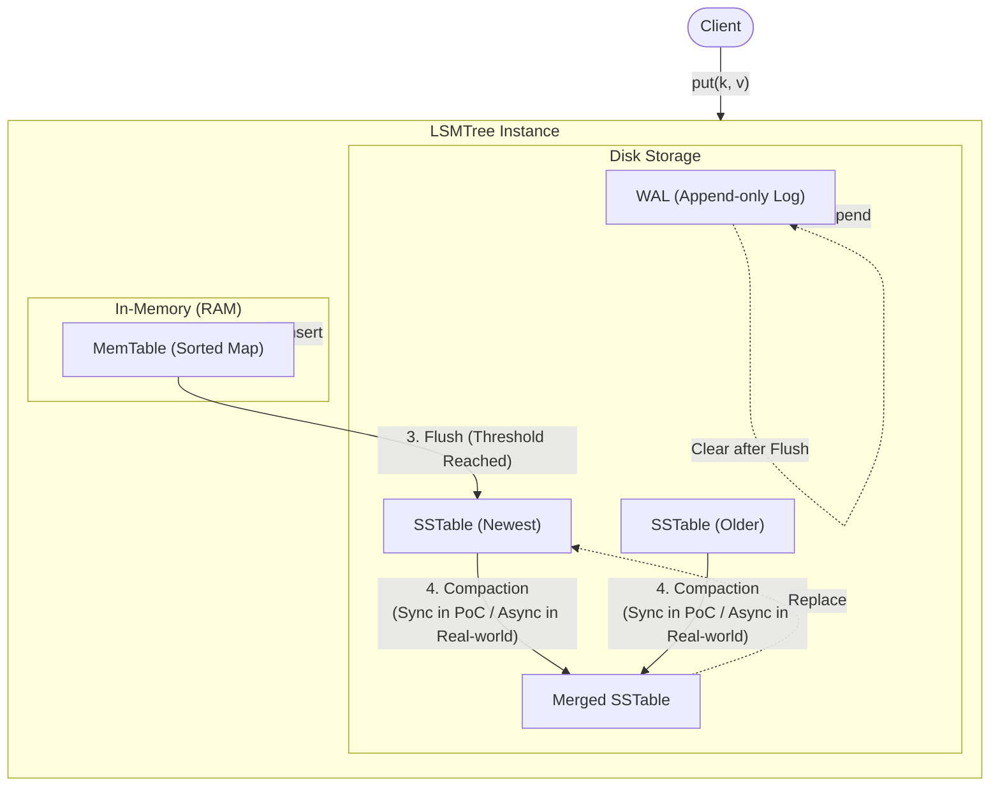

# LSM Tree PoC

DDIA Chapter 3에서 설명하는 LSM-Tree (Log-Structured Merge-Tree)의 간단한 구현체입니다.

## 🔄 데이터 라이프사이클 (Data Lifecycle)

데이터가 시스템에 들어와서 디스크에 영구 저장되고 정리되기까지의 과정입니다.



## 구조

- **MemTable**: 메모리 내의 정렬된 저장소 (여기서는 간단히 Sorted Map 사용)
- **SSTable**: 디스크에 저장된 불변의 정렬된 파일
- **WAL (Write Ahead Log)**: 장애 복구를 위한 로그 (서버 재시작 시 MemTable 복원용)

## 실행 방법

```bash
npm install
npm start
```

## Q&A

### 1. 왜 이 코드엔 Tree가 없나요?

**원래의 LSM Tree(MemTable)** 는 메모리 안에서도 데이터가 항상 **정렬된 상태**를 유지해야 합니다. 그래서 보통은 **Red-Black Tree**나 **Skip List**(트리와 비슷한 역할을 하는 리스트)를 사용합니다.

하지만 이 PoC 코드는 구현의 복잡도를 낮추기 위해 다음과 같은 "꼼수"를 썼습니다:

- **정석 구현:** 데이터가 들어올 때마다 트리(`O(log N)`)에 넣어서 **실시간 정렬 유지**.
- **이 코드 (`MemTable.ts`):** 일단 막 넣기 편한 **해시 맵(`Map`, `O(1)`)** 에 다 넣고, **디스크로 내릴 때(Flush) 한꺼번에 정렬(`sort`)** 해버림.

결과적으로 **"디스크에는 정렬된 파일(SSTable)이 생성된다"** 는 결과는 같지만, 메모리 내부 구조는 트리가 아닌 해시 맵이었던 것입니다.

### 2. 그럼 왜 이름이 LSM "Tree" 인가요?

사실 자료구조 안에 트리가 없어도 이 시스템 전체를 **LSM Tree**라고 부르는 역사적인 이유가 있습니다.

1.  **계층 구조 (Hierarchy as a Tree):**
    LSM Tree 논문(1996)의 원조 개념은 메모리에 있는 작은 트리(C0 Tree)와 디스크에 있는 큰 트리(C1 Tree)를 합치는 구조였습니다. 즉, **데이터 저장소 전체의 계층 구조**가 나무처럼 자라나는 형태라서 "Tree"라고 불립니다.

2.  **실제 상용 DB (RocksDB 등)의 경우:**
    실제 RocksDB 같은 LSM 엔진은 메모리(MemTable)에서 **Skip List**라는 자료구조를 씁니다. Skip List는 트리는 아니지만, 트리처럼 **항상 정렬된 상태를 유지**하고 탐색 속도도 `O(log N)`이라서 "확률적 트리"로 취급됩니다.

### 요약

작성하신 코드는 **"LSM Tree의 동작 방식(로그 구조로 쓰고 병합)"** 을 구현한 것이 맞습니다. 다만, **메모리 내부 자료구조(MemTable)** 부분에서 복잡한 트리 대신 자바스크립트의 내장 `Map`을 사용하여 구현을 단순화한 버전입니다.

**만약 "진짜" 정석대로 구현하고 싶다면?**
`MemTable.ts` 내부의 `Map`을 **Skip List**나 **AVL Tree / Red-Black Tree**로 교체하면 완벽한 LSM Tree 구현체가 됩니다.
