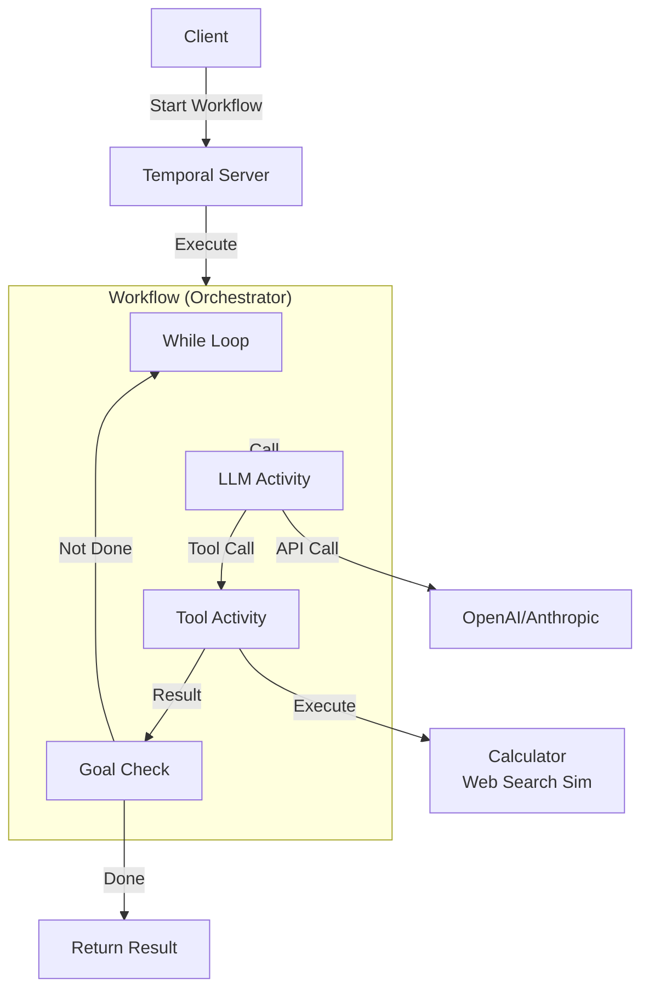

# Temporal + LLM Agentic Loop POC

DDIA Chapter 4에서 배운 **Temporal**을 활용하여 LLM 기반 Agentic Loop를 구현한 Proof of Concept입니다.

## 목표

Temporal의 **Durable Execution**을 활용하여 LLM 호출의 불안정성(타임아웃, 실패)을 자동으로 처리하고, 여러 단계의 도구 호출을 안정적으로 오케스트레이션합니다.

## 아키텍처



## 핵심 기능

1. **Durable Execution**: 워크플로우 중단 시에도 상태 유지 및 재개
2. **자동 재시도**: LLM 호출 실패 시 RetryPolicy로 자동 재시도
3. **상태 관리**: 대화 히스토리와 도구 호출 결과를 워크플로우 상태로 관리
4. **도구 호출**: LLM이 선택한 도구를 Activity로 실행

## 실행 방법

### 1. 의존성 설치

```bash
npm install
```

### 2. 환경 변수 설정

`.env` 파일을 생성하고 다음 내용을 추가하세요:

```env
OPENAI_API_KEY=your_openai_api_key_here
TEMPORAL_ADDRESS=localhost:7233
TEMPORAL_NAMESPACE=default
```

### 3. Temporal 서버 실행

```bash
docker-compose up -d
```

Temporal UI는 `http://localhost:8088`에서 접근할 수 있습니다.

### 4. Worker 실행

별도 터미널에서 Worker를 실행합니다:

```bash
npm run worker
```

### 5. 클라이언트 실행

다른 터미널에서 클라이언트를 실행합니다:

```bash
npm start "5 + 3을 계산하고, 그 결과에 대해 간단한 설명을 작성해줘"
```

또는 기본 목표로 실행:

```bash
npm start
```

## 실행 흐름 예시

```
사용자: "5 + 3을 계산하고, 그 결과에 대해 간단한 설명을 작성해줘"

워크플로우:
1. LLM 호출 → "계산기 도구를 사용해야겠다"
2. 계산기 Activity 실행 → 결과: 8
3. LLM 호출 (결과 포함) → "8에 대한 설명을 작성하겠다"
4. 목표 달성 확인 → 완료
5. 최종 결과 반환
```

## Temporal의 장점

### 1. 자동 재시도

LLM 호출이 실패하거나 타임아웃이 발생하면, Temporal의 RetryPolicy가 자동으로 재시도합니다:

```typescript
retry: {
  initialInterval: '1s',
  backoffCoefficient: 2,
  maximumInterval: '30s',
  maximumAttempts: 5,
}
```

### 2. 상태 관리 자동화

워크플로우의 모든 상태(대화 히스토리, 도구 호출 결과 등)가 Temporal의 Event History에 자동으로 기록됩니다. 별도의 Job 테이블이나 상태 관리 코드가 필요 없습니다.

### 3. Durable Execution

서버가 중단되어도 워크플로우 상태가 유지되며, 재시작 시 중단된 지점부터 이어서 실행됩니다.

### 4. 관측 가능성

Temporal UI에서 워크플로우 실행 상태를 실시간으로 확인할 수 있습니다:

- 각 Activity의 실행 시간
- 재시도 횟수
- 에러 발생 시점
- 전체 실행 흐름

## 파일 구조

```
이세호-poc-temporal-llm/
├── docker-compose.yml          # Temporal 서버
├── package.json
├── tsconfig.json
├── README.md
└── src/
    ├── activities/
    │   ├── llm.ts              # LLM 호출 Activity
    │   ├── tools.ts            # 도구 실행 Activity
    │   └── index.ts
    ├── workflows/
    │   ├── agentic-loop.ts     # 메인 워크플로우
    │   └── index.ts
    ├── types.ts                # 공통 타입 정의
    ├── client.ts               # 클라이언트 진입점
    └── worker.ts               # Worker 진입점
```

## 사용 가능한 도구

### 1. Calculator (계산기)

수학 계산을 수행합니다. 덧셈, 뺄셈, 곱셈, 나눗셈을 지원합니다.

예시:

- `"5 + 3"`
- `"10 * 2"`
- `"20 / 4"`

### 2. Web Search (웹 검색 시뮬레이션)

웹 검색을 시뮬레이션합니다. 실제 API 호출 없이 시뮬레이션된 결과를 반환합니다.

예시:

- `"TypeScript best practices"`

## POC 특성 (가볍게)

- Temporal 서버: Docker Compose로 간단히 실행
- 도구: 2개만 구현 (계산기, 웹 검색 시뮬레이션)
- UI: CLI 기반 (웹 UI는 생략)
- 에러 처리: 기본적인 RetryPolicy만 설정
- Signal/Query: 기본적인 구조만 (고급 기능 생략)

## 참고 자료

- [Temporal 공식 문서](https://docs.temporal.io/)
- [Temporal TypeScript SDK](https://docs.temporal.io/typescript)
- [DDIA Chapter 4 - Encoding and Evolution](https://www.oreilly.com/library/view/designing-data-intensive-applications/9781491903063/)

## 다음 단계 (개선 가능한 부분)

- [ ] 더 많은 도구 추가 (실제 API 연동)
- [ ] Signal/Query를 활용한 사용자 상호작용
- [ ] 워크플로우 체이닝 (여러 워크플로우 연결)
- [ ] 에러 처리 개선 (더 세밀한 재시도 전략)
- [ ] 모니터링 및 알림 추가
