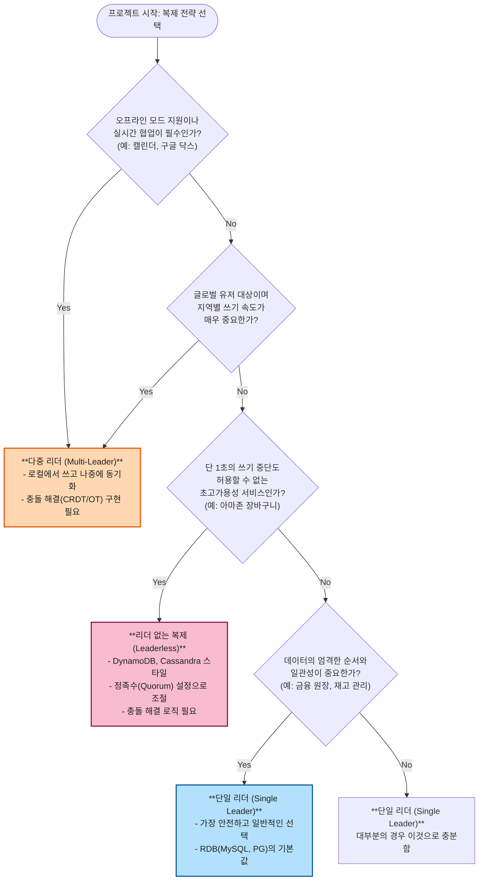
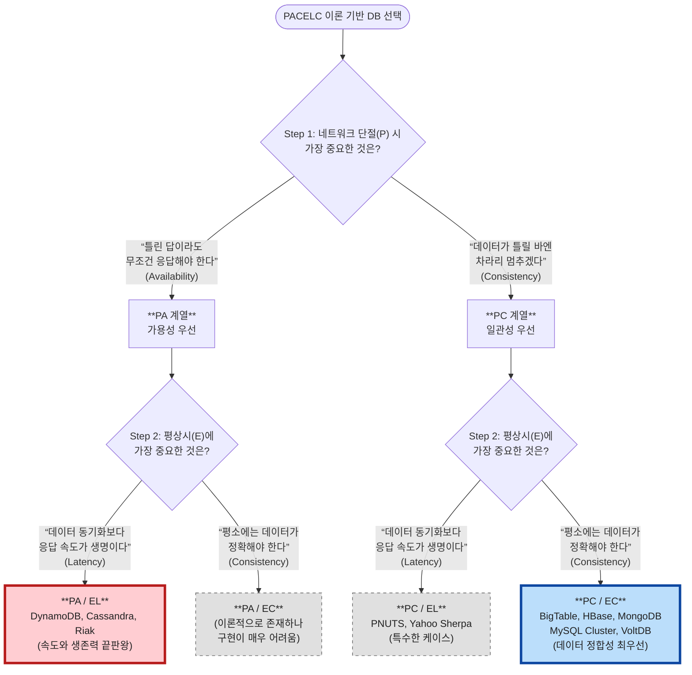

## 복제의 각 방식의 장단점이 뭐지..? 유스케이스가 많이 갈릴 것 같은데..

| 방식          | 쓰기 흐름                      | 장점                              | 단점                                 |
| :------------ | :----------------------------- | :-------------------------------- | :----------------------------------- |
| **단일 리더** | 모든 쓰기는 하나의 리더로 전송 | 이해하기 쉽고 일관성 보장이 강함  | 리더 장애 시 쓰기 불가 (단일 장애점) |
| **다중 리더** | 여러 리더가 쓰기 수락          | 지리적 분산, 오프라인 작업에 강함 | 쓰기 충돌 해결 필요, 약한 일관성     |
| **리더 없는** | 여러 노드에 병렬로 쓰기/읽기   | 결함 내성 및 가용성이 매우 높음   | 복잡한 충돌 감지 및 해결 로직 필요   |



## 스타트업은 어느 시점부터 DB 복제를 고려해야하는가? 몇 TPS + 작업로드?

스타트업에서 DB 복제(Replication)를 도입하는 시점을 결정할 때, 많은 엔지니어들이 **"TPS가 몇이 되면 도입해야 하나요?"** 라고 묻습니다.

하지만 정답은 **"TPS(성능) 때문이 아니라, 죽으면 안 되기 때문에(가용성) 도입한다"** 가 맞습니다.

스타트업의 성장 단계별로 복제를 고려해야 하는 **명확한 기준(Trigger)**을 정리해 드립니다.

---

### 1. 결론부터: TPS는 숫자에 불과하다

최신 클라우드 환경(AWS RDS, Aurora 등)에서 잘 튜닝된 **단일(Single) DB 인스턴스**는 생각보다 엄청난 부하를 견딥니다.

- **단일 노드 성능**: 적절한 인덱싱과 스펙 업(Vertical Scaling)만으로도 **Read 20,000~50,000 TPS / Write 5,000+ TPS**를 충분히 감당합니다.
- **현실**: 대부분의 초기~중기 스타트업은 단일 DB의 한계 성능에 도달해서 복제를 하는 게 아니라, **DB가 죽었을 때 서비스 전체가 멈추는 공포** 때문에 복제를 시작합니다.

---

### 2. 복제 도입을 결정하는 3가지 트리거

TPS 수치보다 아래 3가지 상황이 닥쳤을 때가 진짜 타이밍입니다.

#### ① RPO/RTO 요구사항 (생존의 문제)

- **상황**: "DB 서버가 물리적으로 고장 나거나 AZ(가용 영역) 장애가 발생했을 때, 복구하는 데 1시간 이상 걸려도 되는가?"
- **판단 기준**:
  - 다운타임 1시간 비용 > Replica 서버 한 달 유지비
  - **Action**: TPS가 10이어도, 비즈니스 신뢰도가 중요하다면 **Multi-AZ(Standby)** 복제를 즉시 도입해야 합니다. (성능 향상 목적이 아닌 보험용)

#### ② 분석 쿼리의 간섭 (격리의 문제)

- **상황**: 운영팀이나 CEO가 "지난달 매출 통계 뽑아줘"라고 해서 쿼리를 날렸더니, **서비스 API 응답 속도가 느려지거나 타임아웃**이 발생함.
- **판단 기준**:
  - OLTP(실서비스 트랜잭션)와 OLAP(분석용 쿼리)가 하나의 CPU/Memory를 두고 싸우기 시작할 때.
  - **Action**: **읽기 전용 복제본(Read Replica)**을 하나 만들고, 무거운 분석 쿼리는 전부 거기로 보냅니다.

#### ③ CPU/Memory 병목 (진짜 성능 문제)

- **상황**: 캐시(Redis)를 도입했는데도 불구하고 DB CPU가 상시 **70~80%**를 찍고 있음.
- **판단 기준**:
  - 스케일 업(더 좋은 장비로 교체) 비용이 스케일 아웃(복제본 추가) 비용보다 비효율적일 때.
  - 전체 트래픽 중 **읽기(Read) 비중이 80% 이상**일 때.
  - **Action**: Read Replica를 추가하고 로드밸런싱 합니다.

---

### 3. 스타트업 DB 아키텍처 진화 단계

#### 1단계: MVP ~ 초기 (TPS < 500)

- **구성**: 단일 DB (Single AZ) + 주기적 스냅샷 백업
- **특징**: 돈 아끼는 게 최우선. DB 죽으면 새벽에 개발자가 일어나서 백업본으로 복구함. (복구 시간 1~2시간 소요 허용)

#### 2단계: PMF 달성 후 성장기 (TPS 500 ~ 2,000)

- **구성**: **Primary (Active)** + **Standby (Passive)**
- **목적**: **고가용성(HA)**.
- **특징**: 성능 확장이 아님. Primary가 죽으면 Standby가 즉시 승계(Failover)하여 다운타임을 1분 이내로 줄임. AWS RDS의 "Multi-AZ" 옵션이 이것입니다.

#### 3단계: 트래픽 폭증기 (TPS 2,000 ~ 10,000+)

- **구성**: Primary + Standby + **Read Replica 1~N**
- **목적**: **부하 분산**.
- **특징**: `SELECT` 쿼리는 Read Replica로, `INSERT/UPDATE`는 Primary로 보냄. 애플리케이션 레벨에서 쿼리 라우팅 설정이 필요해짐.
  - _주의: 이때부터 '복제 지연(Replication Lag)' 문제를 고민해야 함._

#### 4단계: 유니콘/대규모 (TPS 10,000++ ~)

- **구성**: 샤딩(Sharding) 또는 NewSQL(TiDB, CockroachDB) 고려
- **목적**: **쓰기 성능 한계 돌파**.
- **특징**: 복제만으로는 리더(Primary) 한 대에 쏟아지는 쓰기 트래픽을 감당할 수 없음. 데이터를 쪼개서 저장해야 함.

---

### 4. 요약: 이것부터 체크하세요

지금 복제를 고민 중이라면 다음 순서대로 자가 진단을 해보세요.

1.  **캐시(Redis/Memcached)는 쓰고 있는가?**
    - 단순 읽기 부하라면 복제본 만드는 것보다 캐싱이 훨씬 싸고 빠르고 효과적입니다.
2.  **인덱스는 잘 걸려 있는가?**
    - TPS 1,000에서 DB가 힘들어한다면, 십중팔구 복제 문제가 아니라 `Slow Query` 문제입니다.
3.  **돈으로 해결(Scale-up)해 보았는가?**
    - 복제 시스템(Scale-out)은 관리 포인트와 복잡도가 급격히 늘어납니다. 월 $200 더 내고 CPU 2배 좋은 거 쓰는 게 스타트업에겐 훨씬 이득입니다.

**결론**:

- **HA(생존)** 목적이라면: TPS 상관없이 **지금 당장** (Standby).
- **성능** 목적이라면: 인덱스 튜닝 -> 캐시 도입 -> 스케일 업(장비 교체) -> 그 다음이 **Read Replica**입니다.

## CAP Theorem

- C: Consistency (일관성)
  - 쉽게 외우기: Copy (복사본)
  - 의미: 여러 서버에 있는 데이터 복사본들이 "언제 어디서 봐도 똑같아야 함" (A 서버에서 1억 입금하면, B 서버에서도 즉시 1억으로 보여야 함).
- A: Availability (가용성)
  - 쉽게 외우기: Anytime (언제든지) / Always (항상)
  - 의미: 서버 하나가 죽거나 문제가 생겨도 사용자의 요청에 "무조건 응답을 해줘야 함" (데이터가 좀 옛날 것일지라도 일단 대답은 해줌).
- P: Partition Tolerance (단절 내성)
  - 쉽게 외우기: Part (부분) / Phone line (통신선)
  - 의미: 서버들이 서로 "나뉘어(Part) 있어도" 혹은 통신선이 끊겨도 시스템이 "버텨야 함(Tolerance)". 분산 시스템이라면 이건 선택이 아니라 필수 조건입니다.
  - 헷갈리는 지점(매우 중요): 파티셔닝이 아니라 완전 다른 개념임. 장애가 생겼을 때를 의미하는 파티션입니다. "네트워크가 단절되었을 때"를 의미합니다.
- 세 줄 요약 암기법 (한 문장 정리)
  - 분산 시스템에서 네트워크가 끊기는 상황(P)이 오면, 우리는 선택해야 합니다.
  - CP: "데이터가 꼬이면 안 돼! 다 맞춰질 때까지 응답하지 마!" (일관성 중시)
  - AP: "일단 서비스는 돌아가야지! 좀 틀린 데이터라도 보여줘!" (가용성 중시)
  - CA: (이건 네트워크가 절대 안 끊기는 완벽한 세상에서만 가능하므로 실제 분산 환경에선 불가능에 가깝습니다.)

우리가 흔히 "MySQL, PostgreSQL은 CA 지향이야"라고 말하는 건, 그 DB들이 **"태생적으로 단일 서버에서 완벽하게 동작하도록(ACID) 설계되었기 때문"**입니다.

이걸 억지로 여러 대의 서버로 늘려서 쓰려고 하니(Replication), "어? 네트워크 끊기면 어떡하지?"라는 CAP의 고민이 뒤늦게 시작되는 것이죠. 그래서 전통적인 RDBMS를 분산 구성하면 보통 다음 둘 중 하나가 됩니다.

- CP에 가깝게 운영: 복제본에 데이터가 다 써질 때까지 기다림. (하나라도 응답 없으면 서비스 멈춤)
- AP에 가깝게 운영: 복제본은 나중에 업데이트되든 말든 일단 응답함. (데이터가 꼬일 수 있음)

- 요즘은 PACELC를 본다고함.

> PACELC란? P(네트워크 파티션) 상황일 때 A(가용성)와 C(일관성) 중 무엇을 택할 것인가? E(그 외 평상시) 상황일 때 L(지연 시간, Latency)과 C(일관성) 중 무엇을 택할 것인가?



## 정족수 이슈

정족수 이론의 핵심 공식인 w+r>n은 어렵게 보이지만, 사실 **"읽는 사람과 쓰는 사람이 반드시 한 명은 겹치게 하라"**는 뜻입니다.

항상 읽기 그룹과 쓰기 그룹이 교집합을 가지도록 숫자를 설정하는 것이 정족수 이론의 전부입니다.

## 등장했던 알고리즘들

### 1. 복제 로그 구현 알고리즘 (Replication Log Implementation)

데이터 변경 사항을 팔로워에게 전달하는 구체적인 방식들입니다.

- **구문 기반 복제 (Statement-based)**: 실행된 SQL 구문(INSERT, UPDATE 등) 자체를 전송합니다.
- **WAL(Write-ahead Log) 전송**: 저장 엔진의 물리적 변경 이력(바이트 단위)을 그대로 전송합니다.
- **논리적(행 기반) 로그 복제 (Logical/Row-based)**: 물리적 구현과 분리하여 '행' 단위의 데이터 변경분만 전송합니다. (CDC 등에 유리)

### 2. 장애 복구 및 동기화 메커니즘 (Failover & Sync)

노드 장애 시 시스템을 유지하고 복구하는 알고리즘입니다.

- **장애 복구 (Failover)**: 리더 장애 시 새로운 리더를 선출(Election)하고 시스템을 재설정하는 과정입니다.
- **펜싱(Fencing) / STONITH**: '스플릿 브레인'(리더가 둘인 현상)을 방지하기 위해 구 리더를 강제로 종료시키거나 격리하는 기법입니다.
- **따라잡기 복구 (Catch-up Recovery)**: 장애 후 복구된 팔로워가 리더의 로그 시퀀스 번호(LSN)를 확인해 누락된 데이터를 보충하는 방식입니다.

### 3. 리더 없는 복제 알고리즘 (Leaderless Replication)

리더 없이 모든 노드가 쓰기를 받는 '다이너모 스타일'의 핵심 기술들입니다.

- **정족수(Quorums) 이론 ($w + r > n$)**: 쓰기($w$)와 읽기($r$) 성공 노드 수의 합이 전체 복제본($n$)보다 커야 한다는 일관성 조건입니다.
- **읽기 복구 (Read Repair)**: 읽기 과정에서 오래된 데이터를 발견하면 즉시 최신 데이터로 업데이트해주는 방식입니다.
- **힌트된 핸드오프 (Hinted Handoff)**: 장애 노드 대신 다른 노드가 임시로 데이터를 받아두었다가, 노드 복구 시 전달해주는 방식입니다.
- **안티 엔트로피 (Anti-entropy)**: 백그라운드 프로세스가 주기적으로 복제본 간의 차이를 비교하여 동기화하는 메커니즘입니다.

### 4. 충돌 감지 및 해결 알고리즘 (Conflict Resolution)

동시 쓰기가 발생했을 때 데이터의 최종 상태를 결정하는 알고리즘입니다.

- **최종 쓰기 승리 (LWW, Last Write Wins)**: 타임스탬프가 가장 큰 데이터만 남기고 나머지는 버리는 방식입니다.
- **버전 벡터 (Version Vectors)**: 인과 관계(Causality)를 추적하여 동시 쓰기 여부를 감지하고, 어떤 데이터가 이전 데이터인지 판별하는 알고리즘입니다.
- **CRDT (Conflict-free Replicated Data Types)**: 고유 ID와 상대적 위치를 이용해 인덱스 변환 없이 자동으로 충돌을 병합하는 데이터 구조입니다.
- **OT (Operational Transformation)**: 구글 독스처럼 동시 작업의 인덱스(위치)를 변환하여 실시간으로 텍스트를 병합하는 기술입니다.

### 5. 일관성 보장 모델 (Consistency Models)

복제 지연 상황에서 사용자 경험을 보호하기 위한 논리적 보장들입니다.

- **자신이 쓴 내용 읽기 (Read-after-write)**: 본인이 쓴 데이터는 즉시 보이도록 보장합니다.
- **단조 읽기 (Monotonic Reads)**: 데이터가 시간순으로만 보이게 하여, 새로고침 시 과거로 돌아가는 현상을 막습니다.
- **일관된 접두사 읽기 (Consistent Prefix Reads)**: "질문-답변"과 같은 인과 관계의 순서를 보장합니다.

## 미팅에서 팀원분들과 주고 받은 이야기 - redis vs 복제

```

## 1. TTL이 짧은 경우 (데이터 신선도)

Redis는 보통 '조회 속도'를 위해 쓰지만, 데이터가 초 단위로 계속 변해서 **TTL(Time To Live)을 극단적으로 짧게 설정해야 한다면** 오히려 독이 될 수 있습니다.

* **Redis의 페널티:** TTL이 짧으면 캐시 미스(Cache Miss)가 자주 발생하고, 그때마다 DB에 가서 데이터를 가져와 Redis에 다시 쓰는 과정(Cache Aside 패턴)이 반복됩니다. 이 과정 자체가 네트워크 비용과 CPU를 소모하죠.
* **Read Replica의 이점:** 복제 DB는 Master와 거의 실시간(수 밀리초~수백 밀리초)으로 동기화됩니다. 따라서 **"캐시를 갱신하는 로직"을 짜는 것보다, 그냥 최신 상태가 반영된 복제 DB에서 읽어오는 것이 아키텍처적으로 훨씬 깔끔**하고 성능상 유리할 수 있습니다.

---

## 2. 캐싱이 어려운 복잡한 쿼리 (검색 및 분석)

Redis는 기본적으로 **Key-Value** 구조입니다. "특정 ID로 조회"하는 것엔 최강이지만, 조건이 붙기 시작하면 골치가 아파집니다.

* **Redis의 한계:** "나이가 20대이면서, 최근 1주일 내 로그인했고, 서울에 사는 유저"를 찾으려면 Redis에서는 모든 데이터를 애플리케이션으로 가져와서 필터링하거나, 아주 복잡한 `Sorted Set` 설계를 해야 합니다.
* **Read Replica의 이점:** RDBMS의 강력한 **Index와 JOIN** 기능을 그대로 쓸 수 있습니다. 정렬, 그룹화, 복합 조건 검색 등은 캐싱하기가 매우 까다로운데, 이때 Read Replica를 여러 대 두면 Master DB에 부담을 주지 않으면서도 강력한 쿼리 기능을 마음껏 활용할 수 있습니다.

---

## 3. 추가로 고려해야 할 "트래픽의 성격"

작성하신 이유 외에도 다음과 같은 상황에서 Read Replica가 대안이 됩니다.

* **데이터의 양 (Volume):** Redis는 메모리 기반이라 비용이 비쌉니다. "자주 보진 않지만 검색은 해야 하는" 수십 기가바이트의 데이터를 전부 Redis에 올리는 것은 가성비가 매우 낮습니다. 이럴 땐 디스크 기반인 Read Replica가 훨씬 경제적입니다.
* **안정적인 일관성:** Redis 캐시가 깨지거나 비워졌을 때(Cache Stampede 현상) 갑자기 모든 트래픽이 Master DB로 몰려 서비스가 뻗을 수 있습니다. Read Replica는 그 자체로 DB 역할을 하므로 이런 급격한 부하 변동에 좀 더 완만하게 대응할 수 있습니다.

---

### **요약하자면**

* **Redis:** "이 데이터는 1초에 수만 번 똑같이 조회된다" + "단순한 Key로 찾을 수 있다"
* **Read Replica:** "조회 조건이 매번 다르고 복잡하다" + "데이터가 너무 자주 변해서 캐시 갱신이 더 힘들다"
```
